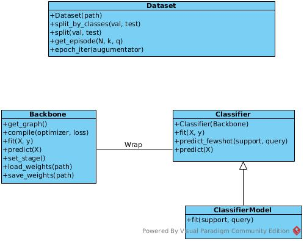

## Введение
Документ основан на статьях:

1. [A Closer Look at Few-shot Classification](https://openreview.net/pdf?id=HkxLXnAcFQ)
1. [Dense Classification and Implanting for Few-Shot Learning](https://arxiv.org/pdf/1903.05050.pdf)
1. [Matching Networks for One Shot Learning](https://arxiv.org/pdf/1606.04080.pdf)

## Описание алгоритмов
В статье [1] рассматриваются два типа алгоритмов: Baseline/Baseline++ и Meta-learning. 
Для работы требуется разделить датасет на два **Base** и **Novel**, так, что множество классов в Base и Novel не пересекаются. Далее обучение происходит на Base датасете, а тестирование на Novel. Так же можно в качестве Base и Novel использовать множества примеров из разных датасетов.

Алгоритмы настраивают классисификатор над вложениями(эмбединги) которые выдает базовая сетка. В статьях базовая сетка называется **Basenet** или **BackboneNet**. Классификатор на вложениях называют **Classifier** . 

Предполагается, что работа будет состоять из следующих этапов:
1. Обучение базовой сетки
1. Обучение классификатора на Base датасете(**Training stage** для Baseline/Baseline++ и **Meta-learning stage**  для Meta-learning)
1. Тестирование получившегося алгоритма на Novel датасете(**Fine-tuning stage** для Baseline/Baseline++ и **Meta-testing stage** для Meta-learning)

### Обучение базовой сетки
Про обучение базовой сетки ничего не нашел в данных статьях. Возможны следующие сценарии:
1. Инициализация сетки случайными весами
1. Использовать предобученные параметры. Здесь надо удостоверится, что мы не используем веса полученные на ImageNet, и, затем тестируемся на tinyImagenet.
1. Обучить сетку на Base датасете как классификатор. Обучение базовой сетки нужно провести на TrainSet, предварительно разделив его на Train и **Validation**, при этом данные множества могут пересекаться по классам.
В результате получаем веса для сетки.

### Training stage
На этой стадии выход базовой сетки соединяется с классификатором, далее происходит обучение по эпохам(**epoch**) на Base датасете. Обучаются либо все, либо часть весов базовой сетки. В данном случае можно использовать валидационный датасет.
В результате этой стадии получаем веса обученной сети для FewShot.

### Meta-learning state
На данной стадии для кроссвалидации нужен датасет. Можно получить его одним из следующих способов:
1. Разделить Base датасет на Train и **ValidationFewShot**, так чтобы эти множества не пересекались по классам. В дальнейшем для обучения используем только Train
1. В качестве валидации использовать другой датасет

В meta-learning обучается классификационная модель(**classification model**). Обучение происходит по эпизодам(**episode**). Эпизод для N-way k-shot состоит из следующих шагов:
1. Выбрать N классов из Base датасета
1. Для каждого класса выбирается k примеров, которые формируют **support set**
1. Для каждого класса выбирается q примеров, которые формируют **query set**

В каждом эпизоде обучаем веса базовой сетки и классификационную модель на support set, минимизируя функцию потерь на query set. Наконец, выбирается сетка, которая дает наиболее высокую точность на ValidationFewShot.
 В результате получаем веса обученной сети для FewShot и, возможно, параметры классификационной модели.

### Fine-tuning/Meta-testing stage
На этой стадии происходит замер средней точности и стандартного отклонения на некотором количестве эпизодов, данные для эпизодов берутся из Novel датасета.
 Из статей не ясно:
 1. Нужно ли изменять веса базовой сетки во время обучения в эпизоде Baseline/Baseline++ модели?
 1. Нужно ли "сбрасывать" параметры классификатора/классификационной модели между эпизодами?

## Архитектура
Работа будет проводится в четырех скриптах:
1. prepare_datasets.py - скачать и разложить датасеты по папкам
1. train_backbone.py - обучение backbone модели.
1. train_fewshot.py - дообучаение модели для использование в FewShot
1. test.py - тестирование модели

Согласование входных параметров скриптов можно делать через единый json для эксперимента.

#### prepare_datasets.py
*Вход*. Путь к папке в которую необходимо скачать и разложить датасеты
*Выход*. Папка с датасетами со следующей структурой:
1.Название датасета
1.1 Имя класса
1.1.1 Картинки

####  train_backbone.py
*Вход*. 
- Сид
- Путь к датасету
- Процент классов для обучения, т.е. для построения Base сета
- Имя обучаемой модели
- Путь к pretrained весам
- Процент примеров для валидации
- Максимальное количество эпох
- Название аугументатора
- Количество эпох без улучшения качества на валидации, если будем использовать early stopping

*Выход*. 
- Файл весов
- Отчет с качеством на тесте/валидации, возможно, другие метрики

####  train_fewshot.py
*Вход*. 
- Сид
- Путь к датасету
- Имя обучаемой backbone модели
- Процент классов для обучения, т.е. для построения Base сета
- Процент классов для валидации, т.е. сколько классов выделить из Base сета для валидации эпизода. Или путь к другому датасету.
- Название аугументатора
- Путь к весам натренированным на предыдущем этапе
- Имя классификатора/модели классификации
- Параметры тренировки - количество эпох, количество эпох для early stopping
- Количество эпизодов(м.б. стоит делать early stopping на эпизодах?)

*Выход*. 
- Файл весов обученной backbone модели, выбранный по лучшему эпизоду.
- Файл параметров классификатора/модели классификации, если он нужен.
- Отчет с качеством на валидации для каждого эпизода. Возможно, для каждого эпизода нужен отчет описывающий процесс обучения во время эпизода

####  test_fewshot.py
*Вход*. 
- Сид
- Путь к датасету
- Имя обучаемой backbone модели
- Процент классов для обучения, чтобы выделить классы для построения Novel сета
- Название аугументатора
- Путь к весам натренированным на предыдущем этапе
- Имя классификатора/модели классификации
- Количество эпизодов

*Выход*. 
- Средняя точность и стандартное отклонение по эпизодам.
- Возможно, для каждого эпизода нужен отчет описывающий процесс обучения во время эпизода

#### Структура классов

**Dataset** - класс который проводит все нужные манипуляции с датасетом:
1. На вход конструктору дается путь к папке с датасетом или None.
1. split_by_classes(val, test): val - процент классов под валидацию, test - процент классов под тест. Возвращает три объекта класса Dataset, которые не пересекаются по классам(train, val, test).
1. split(val, test) - делит датасет на три, которые могут пересекаться по классам. Возвращает три объекта класса Dataset
1. get_episode(N, k, q) - генерирет эпизод из N классов с k элементами в support set и q в query set. Возвращает массивы support_X, support_Y, query_X, query_Y
1. epoch_iter(augumentator) - вовращает итератор, который итерируется по эпохе со соотвествующим аугументатором.

TODO...

